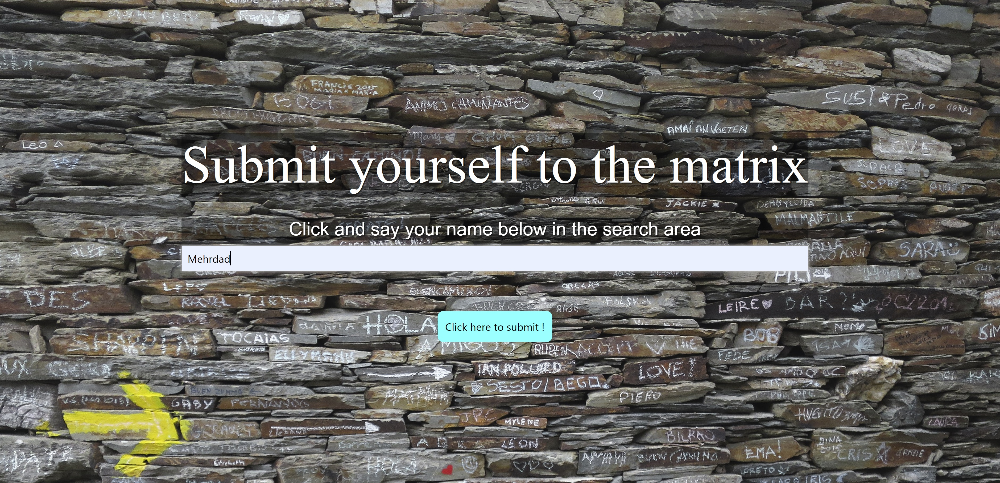
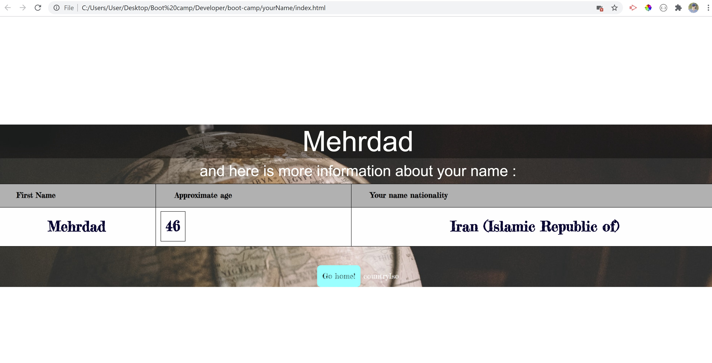

# yourName
Your Name by Merdad Karkudi;

project repository link : https://github.com/mkarkuody/yourName
project link : https://mkarkuody.github.io/yourName/
video of application demo: https://uwseafsfpt082ohb6168.slack.com/files/U0194AT5ZRC/F01DVQEAE1E/your_name.mp4
Some time we wonder what our name’s root or nationality can be, or it’s fun to know how a computer can guess our age according our name. this application simply gets the name and guess your age and your name nationality.
The main idea for this project was from 3 of my classmates and I in University of Washington web developing Bootcamp, and the idea for the name of this project comes from a Japaniese animation “Your name” and I soon I started the project, I knew that “Your name”  can be a good for it.
Your Name. | Trailer (Dubbed) link  in YouTube : https://www.youtube.com/watch?v=o4-URMnBOPU
 For making this application I used HTML, CSS, JQuery, JavaScript.In VS code I created index HTML file added title and added style.css link inside HTML head. used get. foundation, Bootstrap and  W3School to make and style my HTML and css files.
Added container class, created first input tag for first the first interaction with user. 
Added voice recognition button and also type input to make the search easier for people who have hard time to type, the code was produced by “Imran Khan @DevHoot”. Added additional codes in JavaScript page too.
Started style.css with body tag change background image and the other necessary styles.
Add result page hidden (display: none; ) in the same HTML page and added a back ground on the page as well.
Added JS file with two ajax function (Written by Christian faatoafe “My Classmate”) and used my API key to access to data base of random ages and country ISO according the user name.
• Usage:  
1-	tps://validator.w3.org/  helps to check and fix the HTML fils
2-	https://www.w3schools.com/ provides prepared executive codes to safe time for coders.

• Credits:
Got help Online from : 
•	https://www.google.com/
•	https://www.w3schools.com/  
•	www.YouTube.com  (Imran Khan channel)
•            https://get.foundation/
 Thanks to John Young my class instructor and Ben Vaagen my TA. special Thank to Dan Mont-Eton my TA , and Amanda Crawford My Tutor for helping me to understand the class and homework contents.
